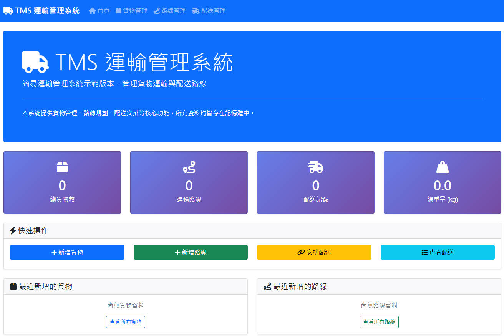

# TMS 運輸管理系統

一個基於 Flask 的簡易運輸管理系統（TMS）示範網站，用於管理貨物運輸與配送路線。



## 功能特色

### 核心功能
- **貨物管理**：新增、編輯、刪除貨物資訊（名稱、數量、重量、描述）
- **路線規劃**：建立運輸路線（起點、終點、途經站點）
- **配送安排**：將貨物指派到特定運輸路線
- **狀態追蹤**：追蹤配送狀態（待配送、配送中、已送達、已取消）
- **搜尋功能**：支援貨物和路線名稱搜尋

### 技術特色
- 使用 Flask 框架開發
- 響應式設計，支援桌面和手機瀏覽
- 記憶體資料儲存（不使用資料庫）
- Bootstrap 5 前端框架
- Font Awesome 圖示庫

## 系統架構

```
VibeCodingTMS/
├── app.py                 # Flask 主應用程式
├── templates/             # HTML 模板
│   ├── base.html         # 基礎模板
│   ├── index.html        # 首頁
│   ├── cargo_list.html   # 貨物列表
│   ├── cargo_form.html   # 貨物表單
│   ├── routes_list.html  # 路線列表
│   ├── routes_form.html  # 路線表單
│   ├── shipments_list.html    # 配送列表
│   └── shipments_assign.html  # 配送安排
├── static/               # 靜態檔案（CSS、JS）
├── requirements.txt      # Python 依賴套件
└── README.md            # 專案說明
```

## 安裝與執行

### 環境需求
- Python 3.7 或以上版本
- pip 套件管理器

### 安裝步驟

1. **克隆專案**
   ```bash
   git clone <repository-url>
   cd VibeCodingTMS
   ```

2. **安裝依賴套件**
   ```bash
   pip install -r requirements.txt
   ```

3. **執行應用程式**
   ```bash
   python app.py
   ```

4. **開啟瀏覽器**
   訪問 `http://localhost:5000`

## 使用說明

### 首頁
- 顯示系統統計資訊（總貨物數、路線數、配送記錄數、總重量）
- 提供快速操作按鈕
- 顯示最近新增的貨物和路線

### 貨物管理
- **新增貨物**：填寫貨物名稱、數量、重量、描述
- **編輯貨物**：修改現有貨物資訊
- **刪除貨物**：移除不需要的貨物
- **搜尋貨物**：根據名稱搜尋貨物

### 路線管理
- **新增路線**：設定路線名稱、起點、終點、途經站點
- **編輯路線**：修改路線資訊
- **刪除路線**：移除不需要的路線
- **搜尋路線**：根據名稱搜尋路線

### 配送管理
- **安排配送**：將貨物指派到特定路線
- **狀態更新**：更新配送狀態（待配送 → 配送中 → 已送達）
- **取消配送**：取消進行中的配送
- **刪除記錄**：移除配送記錄

## 資料結構

### 貨物 (Cargo)
- ID：唯一識別碼
- 名稱：貨物名稱
- 數量：貨物數量
- 重量：單件重量（kg）
- 描述：貨物描述
- 建立時間：建立時間戳

### 路線 (Route)
- ID：唯一識別碼
- 名稱：路線名稱
- 起點：起始地點
- 終點：目的地點
- 途經站點：中途經過的地點列表
- 建立時間：建立時間戳

### 配送 (Shipment)
- ID：唯一識別碼
- 貨物ID：關聯的貨物
- 路線ID：關聯的路線
- 狀態：配送狀態（待配送、配送中、已送達、已取消）
- 建立時間：建立時間戳

## 開發說明

### 資料儲存
本系統使用記憶體儲存，所有資料在應用程式重啟後會重置。適合用於：
- 系統功能示範
- 原型開發
- 學習和測試

### 擴展建議
如需生產環境使用，建議：
- 整合資料庫（SQLite、PostgreSQL、MySQL）
- 加入用戶認證系統
- 實作 API 介面
- 加入資料備份功能
- 優化前端效能

## 技術棧

- **後端**：Python Flask
- **前端**：HTML5、CSS3、JavaScript
- **UI框架**：Bootstrap 5
- **圖示**：Font Awesome 6
- **模板引擎**：Jinja2

## 授權

本專案僅供學習和示範使用。

## 聯絡資訊

如有問題或建議，請聯繫開發團隊。
Vibe Coding TMS
